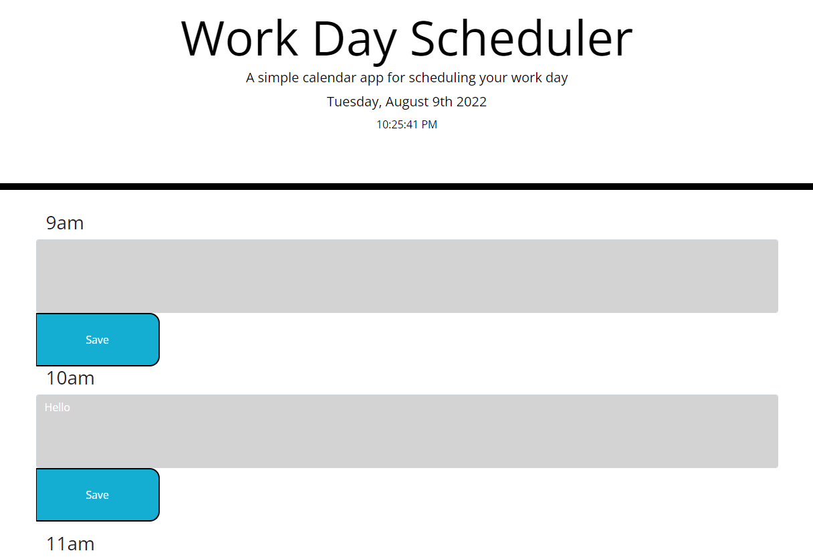
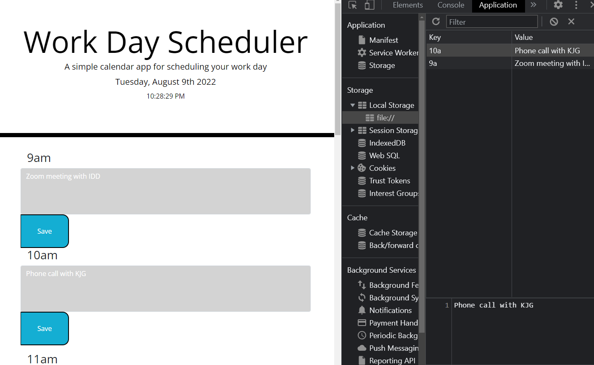
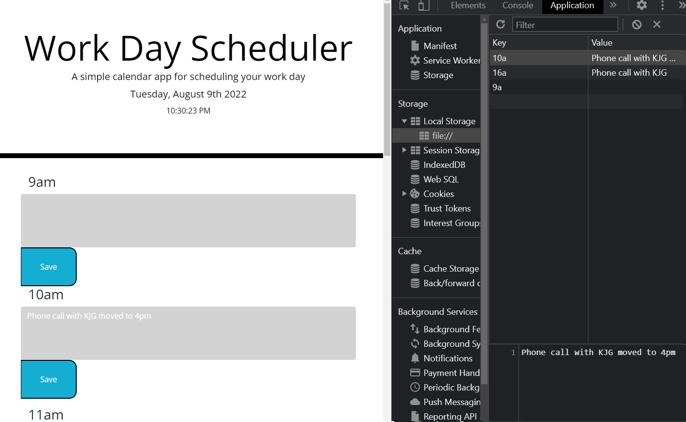
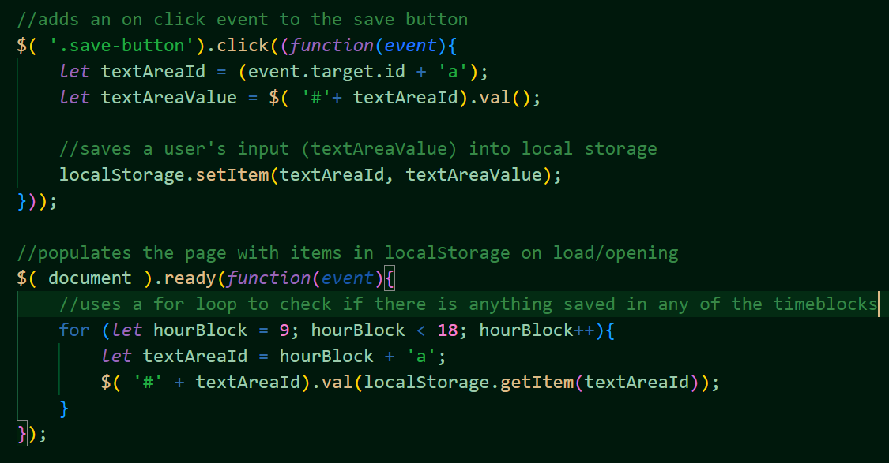

# Work Day Scheduler

The work day scheduler was created to help users keep track of tasks throughout their workday from 9am to 5pm.

## Description

The work day scheduler aides users in keeping track of what tasks they need to complete throught the work day between the hours of 9am to 5pm. The website offers nine different time blocks in which users and type their tasks for the day and save them. The time blocks are color coded. If the time is within the hour, the time block is colored red. If the time is in the past, the time block is colored gray. If the time is in the future, it is colored green. Users click the 'save' button to save tasks to local storage. If users close the page or reload, tasks remain. The tasks are editable and deletable. The user only has to press save with any changes they make.

## Technologies Used

- HTML
- CSS (bootstrap)
- JavaScript (jQuery)

## Usage and Website

[The Work Day Scheduler](https://kirstgonz.github.io/Work-Day-Scheduler/) helps users keep track of tasks they need to complete during their work day. It can be accessed by clicking 'The Work Day Scheduler' or clicking on the link below. No installation is necessary.

- https://kirstgonz.github.io/Work-Day-Scheduler/

Users are able to input any tasks or notes for the day in any time block.

Clicking the 'Save' button will save any user input into local storage.

Once the user wants to delete or edit a task, they will click the save button after their changes have been made.

Below is an example of the JavaScript, using jQuery, code used to place user input into local storage and retrieve it.

## Credits

Starter code made by [Xander Rapstine](https://github.com/Xandromus) 

Built on by [Kirstyn Gonzalez](https://github.com/kirstgonz)

## License

[https://choosealicense.com/](https://choosealicense.com/).

